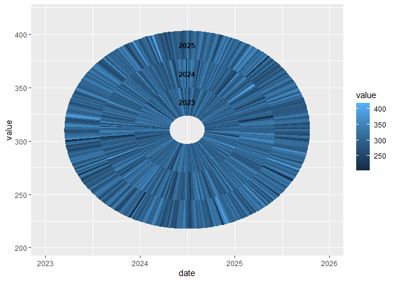

<!-- README.md is generated from README.Rmd. Please edit that file -->

# tsspiral

<!-- badges: start -->

<!-- badges: end -->

The goal of tsspiral is to …

## Installation

You can install the development version of tsspiral from
[GitHub](https://github.com/) with:

``` r
# install.packages("pak")
pak::pak("thiyangt/tsspiralplot")
```

## Example

This is a basic example which shows you how to solve a common problem:

``` r
library(tsspiral)
library(ggplot2)
library(tsibble)
#> Registered S3 method overwritten by 'tsibble':
#>   method               from 
#>   as_tibble.grouped_df dplyr
#> 
#> Attaching package: 'tsibble'
#> The following objects are masked from 'package:base':
#> 
#>     intersect, setdiff, union

dat <- tibble::tibble(
  date = seq.Date( as.Date("2023-01-01"), as.Date("2025-12-31"), by = "day"), 
  value = rnorm(1096, 300, 30)) |>
tsibble::as_tsibble(index = date)

ggplot(dat, aes( x = date, y = value, fill = value)) +
  geom_tsspiral()
```



# Control the spacing between yearly rings

``` r
ggplot(dat, aes(x = date, y = value, fill = value)) +
geom_tsspiral(ring_spacing = 5)
```


