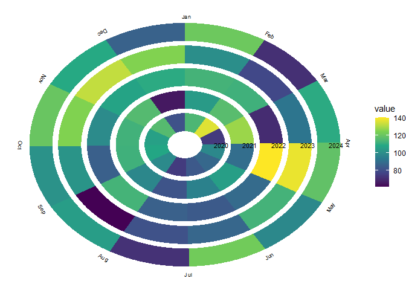
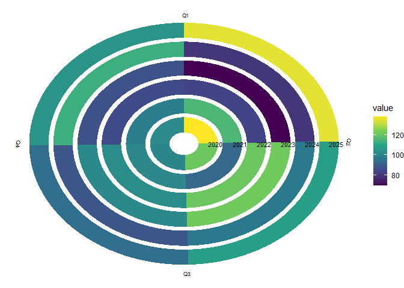
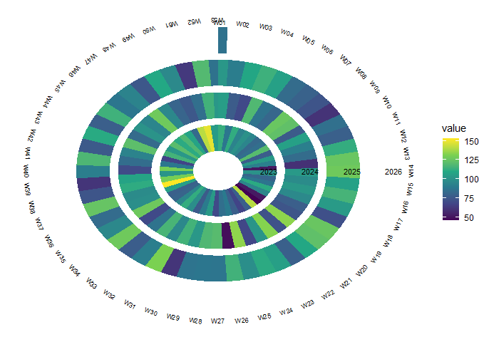
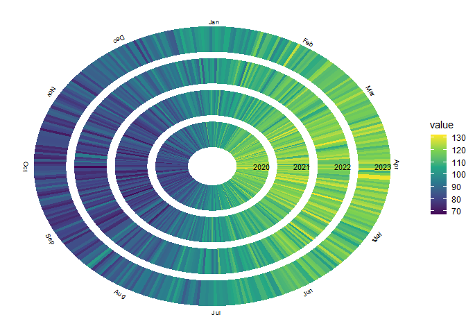

<!-- README.md is generated from README.Rmd. Please edit that file -->

# tsspiral

<!-- badges: start -->

<!-- badges: end -->

The goal of tsspiral is to …

## Installation

You can install the development version of tsspiral from
[GitHub](https://github.com/) with:

``` r
# install.packages("pak")
pak::pak("thiyangt/tsspiralplot")
```

## Applications

### Monthly data

``` r
library(tsspiral)
library(ggplot2)
library(viridis)
#> Loading required package: viridisLite

monthly_data <- data.frame(
  date = seq.Date(
    as.Date("2020-01-01"),
    as.Date("2024-12-01"),
    by = "month"
  )
)

monthly_data$value <- rnorm(
  nrow(monthly_data),
  mean = 100,
  sd = 20
)

ggplot(
  monthly_data,
  aes(
    x = date,
    y = value,
    fill = value
  )
) +
  geom_tsspiral(
    ring_spacing = 2
  ) +
  scale_fill_viridis_c() +
  theme_void()
```


``` r

ggplot(
  monthly_data,
  aes(
    x = date,
    y = value,
    fill = value
  )
) +
  geom_tsspiral(
    ring_spacing = 1
  ) +
  scale_fill_viridis_c() +
  theme_void()
```



## Quarterly

``` r
quarterly_data <- data.frame(
  date = seq.Date(
    as.Date("2020-01-01"),
    as.Date("2025-10-01"),
    by = "quarter"
  )
)

quarterly_data$value <- rnorm(
  nrow(quarterly_data),
  100,
  20
)

ggplot(
  quarterly_data,
  aes(
    x = date,
    y = value,
    fill = value
  )
) +
  geom_tsspiral(
    ring_spacing = 2
  ) +
  scale_fill_viridis_c() +
  theme_void()
```



## Weekly

``` r
weekly_data <- data.frame(
  date = seq.Date(
    as.Date("2023-01-01"),
    as.Date("2025-12-28"),
    by = "week"
  )
)

weekly_data$value <- rnorm(
  nrow(weekly_data),
  100,
  20
)

ggplot(
  weekly_data,
  aes(
    x = date,
    y = value,
    fill = value
  )
) +
  geom_tsspiral(
    ring_spacing = 2
  ) +
  scale_fill_viridis_c() +
  theme_void()
```



## Daily

``` r
set.seed(123)

dat <- data.frame(
  date = seq.Date(
   as.Date("2020-01-01"),
   as.Date("2023-12-31"),
    by = "day"
   )
 )

dat$value <- 100 +
 20 * sin(
    2 * pi *
       lubridate::yday(dat$date) / 365
   ) +
  rnorm(
     nrow(dat),
     sd = 5
   )

 ggplot(
  dat,
  aes(
    x = date,
    y = value,
   fill = value
  ) ) +
  geom_tsspiral(
    ring_spacing = 2
   ) +
   scale_fill_viridis_c() +
   theme_void()
```


